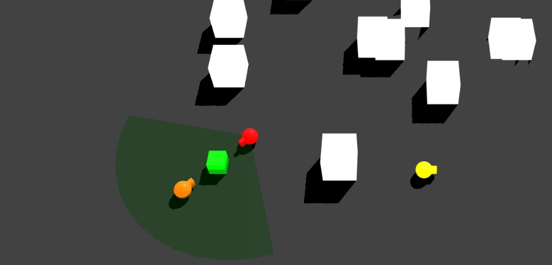

# BABYLON-STEERING


# Intro



A steering behaviors library for [Babylon.js](https://www.babylonjs.com/) for moving entities in the x/z plane. The library was born thanks to these [tutorials](https://gamedevelopment.tutsplus.com/series/understanding-steering-behaviors--gamedev-12732) and the library [three-steer](https://github.com/erosmarcon/three-steer).

The following behavious are supported:
* Seek, Seek with Arrive and Attract (Seek with intensity)
* Flee
* Arrive
* Pursue
* Evade
* Interpose
* Wander
* Collision Avoidance
* Follow Path
* Follow Leader
* Queue
* Cohesion, separation and alignment (Flocking)
* Hide
* Apply general force

Steering Entities can:
* look at a specific target with the .lookAt() method
* look where they are going with the .lookWhereGoing() method

## How to setup

Include `babylon-steering` library:
```javascript

import SteeringVehicle from 'babylon-steering';

```

Create a  Babylon.js 3D scene with a mesh and simply instantiate a Steering Entity linked to this mesh (passing the engine to have the engine.getDeltaTime() and move the entities accordingly ):

```javascript

const redSphere = new SteeringVehicle(my_mesh, engine, options);

/*
    options can be:

    options.maxSpeed || 0.2;
    options.mass || 1;

    // ARRIVAL
    options.arrivalThreshold || 100;

    // AVOID
    options.avoidDistance || 120;
    options.radius || 100;

    // WANDER
    options.wanderDistance || 10;
    options.wanderAngle || 10;
    options.wanderRadius || 5;
    options.wanderRange || 20;

    // QUEUE
    options.inSightDistance || 200;
    options.tooCloseDistance || 60;
*/

```

Add the behavior/s to the steering entity and the update method inside main render/animation loop:

```javascript

scene.executeWhenReady(function () {
        engine.runRenderLoop(function () {

            my_mesh
                .seekWithArrive(greenTarget, 50)
                .hasInConeOfView(arrayOfEnemies)
                .avoid(obstacleIstances)
                .applyForce(new BABYLON.Vector3(1, 0, 0.75))    // For istance can be WIND...
                .lookWhereGoing(true);

            my_mesh.animate();  // Update the Steering Vehicle

            scene.render();
        });
});

```
# Combine behaviours

It is possible to combine many simultaneous steering forces by passing the following parameters to the `.animate()` function according to the four methods described in this [bog post](https://alastaira.wordpress.com/2013/03/13/methods-for-combining-autonomous-steering-behaviours/):
* `priority` for Priority Arbitration
* `weighted` for Weighted Blending, 
* `probability` for 'Prioritised Dithering'
* `truncated` for 'Weighted Prioritised Truncated Sum'

```javascript

scene.executeWhenReady(function () {
        engine.runRenderLoop(function () {

            blueSphere
                .seek(greenBox, 50, { weigth: 1.7, priority: 1, probability: 0.6 })
                .flee(redSphere, 160, { weigth: 0.5, priority: 5, probability: 0.6 })
                .lookTarget(redSphere) // or .lookWhereGoing(true)
                .avoid(obstacleIstances, { weigth: 1, weigth: 0.8, probability: 0.6 });

            blueSphere.animate('blend');  // 'blend' 'priority' 'probability'  'truncated' 
            
            obstacleIstances.forEach(e => {
                    e.animate();
            });

            scene.render();
        });
});


```

## Demo

```bash
# 1) istall dependencies
npm install
# 2) run the development server serving static demo pages at localhost:4000
npm start

# only demo page for seek, flee, avoid and hide are available....

```

## Bugs
- `wander`, `avoid` and `flock` are still work in progress!
- Let me know!

## Built With

ES6 Javascript, [microbundle](https://github.com/developit/microbundle), [Babylon.js](https://www.babylonjs.com/)

## License

This project is licensed under the ISC License.